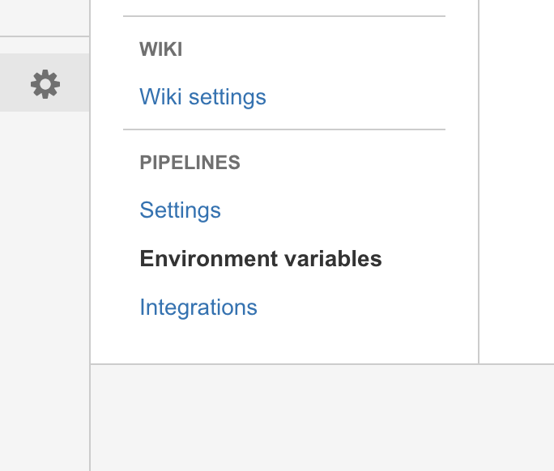
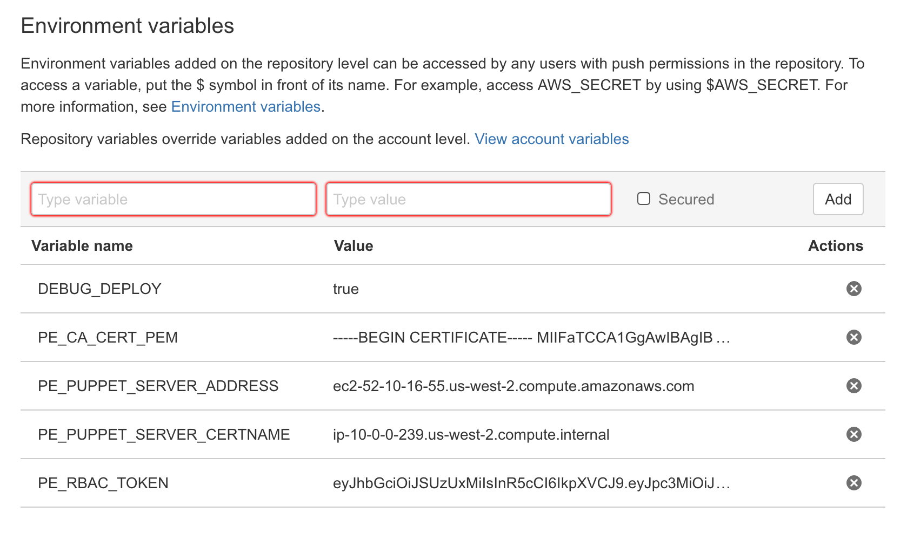

# Puppet Enterprise and Atlassian Bitbucket Pipelines

Bitbucket Pipelines represents the evolution of Bitbucket from being a simple GIT repository into an Enterprise level testing and version control solution.

Hosted within Bitbucket Cloud, Bitbucket Pipelines allows customers to create a one-stop-shop handling the end-to-end process of receiving, testing and deploying Puppet Code.

Integrating Bitbucket Pipelines with Puppet Enterprise is quick, easy and secure.  In a nutshell, the steps are:

1.  Developer checks in code to GIT
2.  Pipelines tests the code
3.  Pipelines runs a script to deploy the code to your Puppet Master

Pipelines is able to integrate existing test tools by executing them in-order and watching for exit status codes indicating test failure.  The deployment of code is handled by the Puppet Code Manager service (formerly R10K) which is responsible for ensuring the desired code is present on your Puppet Master.

# How Bitbucket Pipelines works
All testing is carried out inside a docker container which makes it easy to replicate and troubleshoot failing builds if required.  The steps forming a pipeline are described in the file `bitbucket-pipelines.yml` in the top level of a given repository.

Bitbucket Pipelines executes each step of the defined pipeline and returns the final status as the overall build status, with zero indicating a successful build and non-zero indicating failure.

To deploy code to a Puppet Master, the final step of the testing process is the use of the `curl` command to trigger the deployment.

# Getting Started
There are two main artefacts of code deployment for Puppet:  Puppet Modules and Puppet Control Repositories.

## Puppet modules
Puppet modules bundle discrete resources into a named reusable module.  These can be made available on the [Puppet Forge](forge.puppetlabs.com) or uploaded directly to your Pupet Master.

### Testing Puppet modules
The easiest way to test Puppet Modules is with [RSpec-Puppet](http://rspec-puppet.com/).  You can think of this tool as being able to build a Puppet catalogue and then check for the presence or absence of given resources or conditions within it.  At its simplest, these tests could just be to ensure that the catalogue compiles.

A boilerplate test infrastructure for new modules is generated by the command `puppet module generate` although you will have to create a [.fixtures.yml file](https://github.com/puppetlabs/puppetlabs_spec_helper#using-fixtures) yourself.

With a freshly generated module and addition of a `fixtures.yml` file, getting testing up and running with Bitbucket Pipelines is as easy adding a `bitbucket-pipelines.yml` file to your project with the following content:

```yaml
image: ruby:2.3.0

pipelines:
  default:
    - step:
        script: # Modify the commands below to build your repository.
          - ruby --version
          - bundler --version
          - bundle install
          #
          # Syntax tests
          #

          # These can be done as a pre-commit hook but we can't rely on this
          # having been setup

          # puppet files
          - find . -name '*.pp' -not -path './.onceover/*' | xargs -n1 puppet parser validate

          # ERB files
          - find . -name '*.erb' -not -path './.onceover/*' | xargs -n1 -I {} sh -c "erb -P -x -T '-' {} | ruby -c >/dev/null || echo ERB syntax error in {} ; exit 1"

          # YAML files
          - find . -name '*.yaml' -not -path './.onceover/*' | xargs -n1 -I {} ruby -ryaml -e "YAML.load_file '"{}"' "

          - bundle exec rake spec
```

This will perform syntax validation and will run the required test suite.  Please see https://bitbucket.org/geoff_williams/my_puppet_module for a working example module.

To deploy the code directly to your Puppet Master, follow the instructions for testing Puppet Control Repositories from step 2 onwards and reference the latest git commit of your module in your control repository's `Puppetfile`.

## Puppet Control Repositories
Puppet Control Repositories bind together:
* [Hiera](https://docs.puppet.com/hiera/3.2/) User data
* The modules to install on a Puppet Master, described in a [Puppetfile](https://github.com/puppetlabs/r10k/blob/master/doc/puppetfile.mkd)
* [Roles and Profiles](https://docs.puppet.com/pe/2016.2/r_n_p_intro.html) to use at a given customer site
* [Node definitions](https://docs.puppet.com/puppet/latest/reference/lang_node_definitions.html) attaching specific resources to nodes

### Testing
Testing Puppet Control repositories has traditionally been more involved then the testing of individual modules.  Fortunately, we now have [Onceover](https://github.com/dylanratcliffe/onceover) which exists to get organisations up and running quickly in terms of being able to test the quality of their Puppet Control Repository code.

Testing with onceover is a simple process:
1.  `bundle exec onceover init` # Generate updated tests
2.  `bundle exec onceover run spec` # Execute the tests

The program's exit status indicates whether the tests passed or failed.  If all tests pass, then the code is ready to be deployed to the Puppet Master and this action is triggered by making a request to the Code Manager API using `curl`.

There are five steps to configure the end-to-end process in Bitbucket Pipelines and Puppet Enterprise:

#### 1. Configure the pipeline
_Save the following content to `bitbucket-pipelines.yml`_

```yaml
image: ruby:2.3.0

pipelines:
  default:
    - step:
        script: # Modify the commands below to build your repository.
          - ruby --version
          - bundler --version
          # ruby:2.3.0 bundler gives load error, fixed in later versions
          - gem install bundler -v 1.13.1
          - bundle install

          #
          # Syntax tests
          #

          # These can be done as a pre-commit hook but we can't rely on this
          # having been setup

          # puppet files
          - find . -name '*.pp' -not -path './.onceover/*' | xargs -n1 puppet parser validate

          # ERB files
          - find . -name '*.erb' -not -path './.onceover/*' | xargs -n1 -I {} sh -c "erb -P -x -T '-' {} | ruby -c >/dev/null || echo ERB syntax error in {} ; exit 1"

          # YAML files
          - find . -name '*.yaml' -not -path './.onceover/*' | xargs -n1 -I {} ruby -ryaml -e "YAML.load_file '"{}"' "

          #
          # Onceover (RSpec Puppet) tests against local roles and profiles
          #

          # setup onceover here rather then storing its files in the repo.
          # This lets us account for any new roles and profiles that have
          # been added in the interim
          - bundle exec onceover init
          - bundle exec onceover run spec
          - ./puppet_code_manager.sh

```

#### 2. Add the deployment script
_Save the following content to `puppet_code_manager.sh` and make it executable_

```bash
#!/bin/bash
#
# Deploy code to a Puppet Enterprise master using Puppet Code Manager using curl
# to trigger its REST API.
#
# Usage
# -----
# Invoke the script with no arguments, it will use shell variables to obtain
# the necessary authentication tokens and hostnames
#
# Environment Varaibles
# ---------------------
#
# `PE_RBAC_TOKEN`
# MANDATORY:  A valid authentication token for the Puppet Enterprise RBAC API
# see https://docs.puppet.com/pe/latest/rbac_token_auth.html#generating-a-token-for-use-by-a-service
# for instructions on how to obtain one
#
# `PE_PUPPET_SERVER_CERTNAME`
# MANDATORY:  The certname belonging to the Puppet Master.  Usually this is the
# same as the hostname we need to use to talk to the machine, however, in cloud
# and multi-homed environments, it can be different.
#
# `PE_CA_CERT_PEM`
# MANDATORY unless insecure mode forced:  The contents of the CA Certificate on
# the Puppet Enterprise master.  This is the contents of the file at
# /etc/puppetlabs/puppet/ssl/certs/ca.pem
#
# `PE_PUPPET_SERVER_ADDRESS`
# OPTIONAL:  Your Puppet Enterprise master's internal certificate name MUST
# match the hostname requested with curl.  You may need this option if you are
# using a public cloud service that allocates both public and private DNS names
# for hosts if you haven't employed the pe_install::puppet_master_dnsaltnames
# option during installation (see: https://docs.puppet.com/pe/latest/install_pe_conf_param.html#additional-parameters-for-monolithic-and-split-installations).  If used, this option specifies the DNS
# name we should use to talk to the puppet master while still using the
# hostname supplied in PE_PUPPET_SERVER_CERTNAME.  This is equivalent to adding
# an entry to /etc/hosts but is less invasive.
#
# `FORCE_INSECURE_CONNECTION`
# OPTIONAL:  Force an insecure connection to the puppet master.  Not recommended
#
# `DEBUG_DEPLOY`
# OPTIONAL:  Run BASH in debug mode

# errors
set -e

# fail right side of pipe if left side fails
set -o pipefail


if [ "$DEBUG_DEPLOY" ] ; then
  echo "Entering debug mode..."
  set -x
fi

CODE_MANAGER_PORT=8170
CODE_MANAGER_ENDPOINT="/code-manager/v1/deploys"
CA_CERT="/tmp/ca.cert"

if [ -z "$PE_RBAC_TOKEN" ] ; then
  echo "Please set PE_RBAC_TOKEN to the contents of a valid Puppet Enterprise RBAC token"
  exit 1
fi
if [ -z "$PE_PUPPET_SERVER_CERTNAME" ] ; then
  echo "Please set PE_PUPPET_SERVER_CERTNAME to the name matching the your Puppet Master's certname.  You can find this by running `puppet config print certname` on the master"
  exit 1
fi
if [ -z "$PE_CA_CERT_PEM" ] ; then
  echo "Please set PE_CA_CERT_PEM to the contents of /etc/puppetlabs/puppet/ssl/certs/ca.pem on your puppet master to verify the certificate chain"
  if [ -z "$FORCE_INSECURE_CONNECTION" ] ; then
    exit 1
  else
    echo "WARNING:  Forcing insecure SSL connection to the Puppet Master, as you have requested"
    CA_OPT="-k"
  fi
else
  # newlines will be flattened to spaces so we need to fixup our pem file
  echo "$PE_CA_CERT_PEM" | awk 'BEGIN{RS=" " ; print "-----BEGIN CERTIFICATE-----"} !/-----/ {print} END{print "-----END CERTIFICATE-----"}' > $CA_CERT
  CA_OPT="--cacert ${CA_CERT}"

  if [ "$PE_PUPPET_SERVER_ADDRESS" ] ; then
    # curl REQUIRES we convert the address/hostname to an IP address
set -e
    PE_PUPPET_SERVER_IP=$(getent hosts $PE_PUPPET_SERVER_ADDRESS | awk '{print $1}')

    CA_OPT="${CA_OPT} --resolve ${PE_PUPPET_SERVER_CERTNAME}:${CODE_MANAGER_PORT}:${PE_PUPPET_SERVER_IP}"
  fi
fi

# undefined variables
set -u

TARGET="https://${PE_PUPPET_SERVER_CERTNAME}:${CODE_MANAGER_PORT}${CODE_MANAGER_ENDPOINT}"
PAYLOAD='{"deploy-all": true}'
echo "Attempt POST to service URI: ${TARGET}"
OUTPUT=$(curl ${CA_OPT} -X POST -H "X-Authentication: ${PE_RBAC_TOKEN}" -H 'Content-Type: application/json' "$TARGET" -d "$PAYLOAD")

if [ $(echo "$OUTPUT" | grep '"status":"queued"') ] ; then
  echo "*** code queued for deployment on ${PE_PUPPET_SERVER_CERTNAME} ***"
else
  echo "Error deploying code to ${PE_PUPPET_SERVER_CERTNAME}:"
  echo "$OUTPUT"
  exit 1
fi
```

#### 3. Configure Puppet Enterprise
1.  [Enable Code Manager](https://docs.puppet.com/pe/latest/code_mgr_config.html#enable-code-manager)
2. [Create a new RBAC user and set a password](https://docs.puppet.com/pe/latest/rbac_user_roles.html#create-a-new-user)
3. [Add the new user to the `Code Deployers` RBAC role](https://docs.puppet.com/pe/latest/rbac_user_roles.html#add-a-user-to-a-user-role)
4. [Generate an RBAC token](https://docs.puppet.com/pe/latest/rbac_token_auth.html#generating-a-token-for-use-by-a-service)

#### 4. Obtain authentication tokens and server details from the Puppet Master
* Contents of the CA Certificate, available at `/etc/puppetlabs/puppet/ssl/certs/ca.pem`
* The configured certname, available by running `puppet config print certname`
* The IP address or public DNS address of the Puppet Master
* The contents of the RBAC authentication token you created

#### 5. Add environment variables to Bitbucket Pipelines
From the main Bitbucket page for your repository, open the `Environment variables` screen:
1. Click settings
2. Scroll down to `Pipelines`
3. Click `Environment variables`


Now enter the details you collected earlier:
* `PE_CA_CERT_PEM` - Copy and paste the contents of your CA certificate
* `PE_PUPPET_SERVER_CERTNAME` - the certname of your puppet master
* `PE_RBAC_TOKEN` - Paste the contents of your RBAC token
* `PE_PUPPET_SERVER_ADDRESS` - Public DNS name of your puppet master (if different to `PE_SERVER_CERTNAME`)
* `DEBUG_DEPLOY` - (optional) If you would like to run the deployment script in bash debug mode, set this variable to true


That's it - next time you push code to the repository you should see it being deployed to your Puppet Master.  You can see a complete working example at https://bitbucket.org/geoff_williams/my_puppet_control_repo

# Troubleshooting
* Ensure that TCP port 8170 to your puppet master is open
* Be sure that authentication tokens were copied and pasted correctly
* To debug a failed build, you can create an identical container locally by running:
```shell
docker run -ti --entrypoint=/bin/bash "ruby:2.3.0"
```
* Make sure you are accessing the Puppet Master using the correct certname'
* As a last resort, you can disable SSL certificate verification by setting the Environment Variable `FORCE_INSECURE_CONNECTION` to true.  Note that this exposes you to impersonation attacks.
